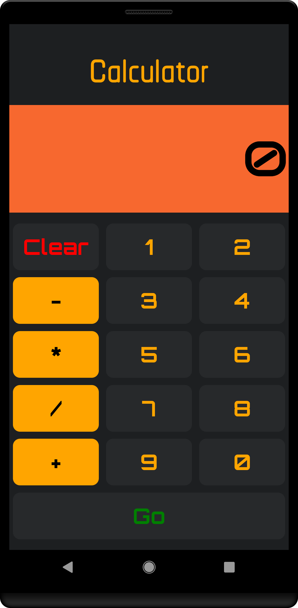

# Calculator built with React-native
This is a project to understand React-native and deploying to the Google Play store. It's based around a walkthrough by Karl Penzhorn.
It is built using Android Studio. I use the emulator to see a display which constantly refreshs with your changes.
# How it looks

